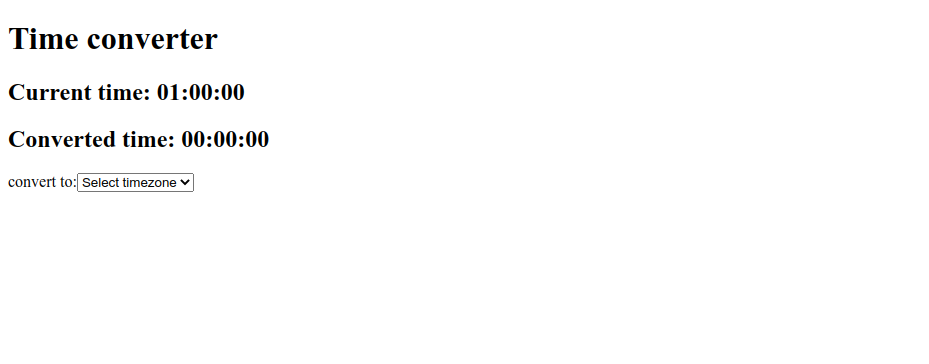

# useState and Event Handling

## Exercise - 3

### NOTES

- Pada skeleton kode yang terdapat file `main.test.js` tidak boleh diubah sama sekali.
- Dilarang mengganti nama function yang diberikan.
- Wajib menjalankan `npm install` atau `pnpm install` sebelum mengerjakan final project.

### Description

**Time Converter** merupakan sebuah web sederhana untuk mengkonversi waktu berdasarkan timezone yang dipilih. Kalian diminta untuk mengerjakan pada file `App.js`



Bualah sebuah `state` dan `event handling`-nya yang mana jika kita memilih suatu _timezone_ maka akan menampilkan waktu yang telah di-_convert_ dari _current time_ yang telah ada. Gunakanlah tag HTML `select` untuk mengerjakannya, berikut teks untuk `options` dan `time zone` _code_ yang perlu kalian gunakan.

| Option text | Timezone Code    |
| ----------- | ---------------- |
| Tokyo       | Asia/Tokyo       |
| New York    | America/New_York |
| Madrid      | Europe/Madrid    |
| Cairo       | Africa/Cairo     |
| Sydney      | Australia/Sydney |

```html
// contoh options
<option>Select timezone</option>
<option>Jakarta</option>
<option>Tokyo</option>
```

Kalian wajib membuat 1 option dengan teks "**Select timezone**" yang memiliki _value_ berupa _string_ kosong (`""`). Jika opsi ini dipilih maka "**_Converted time_**" akan menampilkan waktu "00:00:00" (lihat contoh gambar diatas). Buatlah _Converted time_ menggunakan tag HTML `h2`.

Berikut contoh yang perlu kalian buat:

