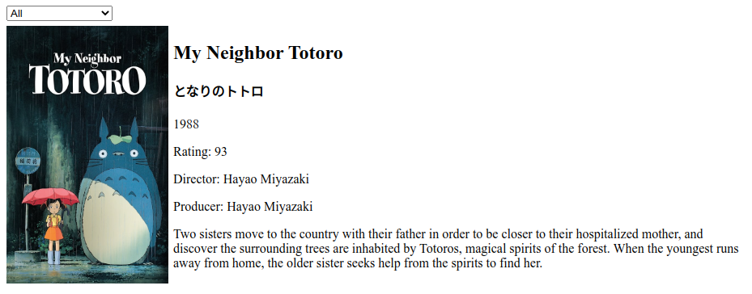
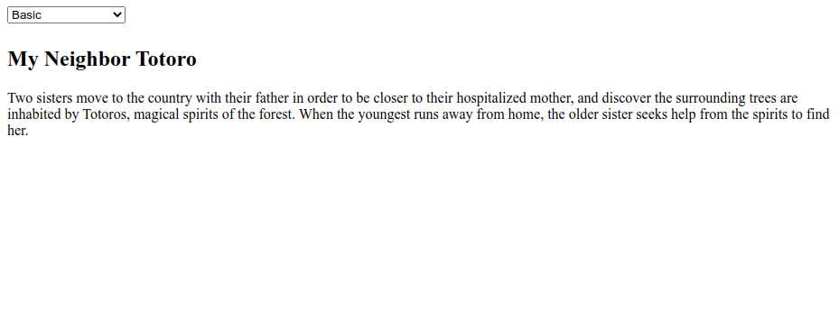
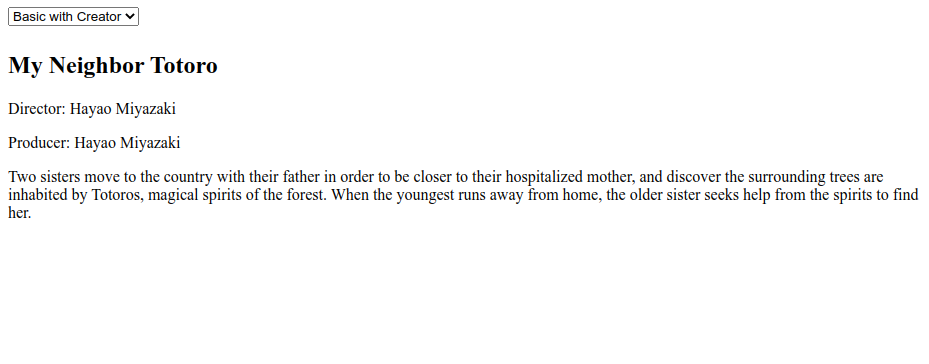

# useEffect and Data Fetching

## Exercise - 4

### NOTES

- Pada skeleton kode yang terdapat file `main.test.js` tidak boleh diubah sama sekali.
- Dilarang mengganti nama function yang diberikan.
- Wajib menjalankan `npm install` atau `pnpm install` sebelum mengerjakan final project.

### Description

**Ghibli App** merupakan sebuah web sederhana untuk menampilkan beberapa data terkait film **My Neighbor Totoro**. Kalian diminta untuk mengerjakan pada file `App.js` dan melakukan _fetch_ data dari sebuah _3rd party API_ yang sudah disediakan dengan beberapa kriteria tertentu, yaitu:

- Jika seluruh data yang di tampilkan

  ```txt
  https://ghibliapi.fly.dev/films/58611129-2dbc-4a81-a72f-77ddfc1b1b49
  ```

  Contoh result dari _3rd party API_ di atas berupa JSON dengan format:

  ```json
  {
    "id": "58611129-2dbc-4a81-a72f-77ddfc1b1b49",
    "title": "My Neighbor Totoro",
    "original_title": "となりのトトロ",
    "original_title_romanised": "Tonari no Totoro",
    "image": "https://image.tmdb.org/t/p/w600_and_h900_bestv2/rtGDOeG9LzoerkDGZF9dnVeLppL.jpg",
    "movie_banner": "https://image.tmdb.org/t/p/original/etqr6fOOCXQOgwrQXaKwenTSuzx.jpg",
    "description": "Two sisters move to the country with their father in order to be closer to their hospitalized mother, and discover the surrounding trees are inhabited by Totoros, magical spirits of the forest. When the youngest runs away from home, the older sister seeks help from the spirits to find her.",
    "director": "Hayao Miyazaki",
    "producer": "Hayao Miyazaki",
    "release_date": "1988",
    "running_time": "86",
    "rt_score": "93",
    "people": [
      "https://ghibliapi.fly.dev/people/986faac6-67e3-4fb8-a9ee-bad077c2e7fe",
      "https://ghibliapi.fly.dev/people/d5df3c04-f355-4038-833c-83bd3502b6b9",
      "https://ghibliapi.fly.dev/people/3031caa8-eb1a-41c6-ab93-dd091b541e11",
      "https://ghibliapi.fly.dev/people/87b68b97-3774-495b-bf80-495a5f3e672d",
      "https://ghibliapi.fly.dev/people/d39deecb-2bd0-4770-8b45-485f26e1381f",
      "https://ghibliapi.fly.dev/people/591524bc-04fe-4e60-8d61-2425e42ffb2a",
      "https://ghibliapi.fly.dev/people/c491755a-407d-4d6e-b58a-240ec78b5061",
      "https://ghibliapi.fly.dev/people/f467e18e-3694-409f-bdb3-be891ade1106",
      "https://ghibliapi.fly.dev/people/08ffbce4-7f94-476a-95bc-76d3c3969c19",
      "https://ghibliapi.fly.dev/people/0f8ef701-b4c7-4f15-bd15-368c7fe38d0a"
    ],
    "species": [
      "https://ghibliapi.fly.dev/species/af3910a6-429f-4c74-9ad5-dfe1c4aa04f2",
      "https://ghibliapi.fly.dev/species/603428ba-8a86-4b0b-a9f1-65df6abef3d3",
      "https://ghibliapi.fly.dev/species/74b7f547-1577-4430-806c-c358c8b6bcf5"
    ],
    "locations": ["https://ghibliapi.fly.dev/locations/"],
    "vehicles": ["https://ghibliapi.fly.dev/vehicles/"],
    "url": "https://ghibliapi.fly.dev/films/58611129-2dbc-4a81-a72f-77ddfc1b1b49"
  }
  ```

  

- Jika basic data yang di tampilkan (**Title and Description**)

  ```txt
  https://ghibliapi.fly.dev/films/58611129-2dbc-4a81-a72f-77ddfc1b1b49?fields=title,description
  ```

  Contoh result dari _3rd party API_ di atas berupa JSON dengan format:

  ```json
  {
    "title": "My Neighbor Totoro",
    "description": "Two sisters move to the country with their father in order to be closer to their hospitalized mother, and discover the surrounding trees are inhabited by Totoros, magical spirits of the forest. When the youngest runs away from home, the older sister seeks help from the spirits to find her."
  }
  ```

  

- Jika basic data with creator yang di tampilkan (**Title, Description, Director, and Producer**)

  ```txt
  https://ghibliapi.fly.dev/films/58611129-2dbc-4a81-a72f-77ddfc1b1b49?fields=title,description,director,producer
  ```

  Contoh result dari _3rd party API_ di atas berupa JSON dengan format:

  ```json
  {
    "title": "My Neighbor Totoro",
    "description": "Two sisters move to the country with their father in order to be closer to their hospitalized mother, and discover the surrounding trees are inhabited by Totoros, magical spirits of the forest. When the youngest runs away from home, the older sister seeks help from the spirits to find her.",
    "director": "Hayao Miyazaki",
    "producer": "Hayao Miyazaki"
  }
  ```

  

Jika data belum ada maka akan menampilkan pesan "**Loading...**" dalam tag HTML `h2`. Gunakanlah tag HTML `select` untuk mengerjakannya, dimana teks untuk `option`-nya yaitu:

- `All` untuk menampilkan **seluruh data**
- `Basic` untuk menampilkan **basic data**
- `Basic with Creator` untuk menampilkan **basic data with creator**

```html
// contoh untuk menampilkan seluruh data
<option>All</option>
```

Berikut ini ketentuan dan format yang perlu kalian buat untuk menampilkan data.

```txt
<image>
<title>
<original_title>
<release_date>
Rating: <rt_score>
Director: <director>
Producer: <producer>
<description>
```

- `image` menggunakan tag HTML `img`.
- `title` menggunakan tag HTML `h2`.
- `original_title` menggunakan tag HTML `h4`.
- `release_date`, `rt_score`, `director`, `producer` dan `description` menggunakan tag HTML `p`
