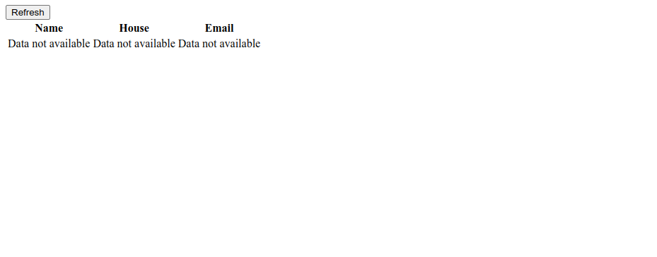
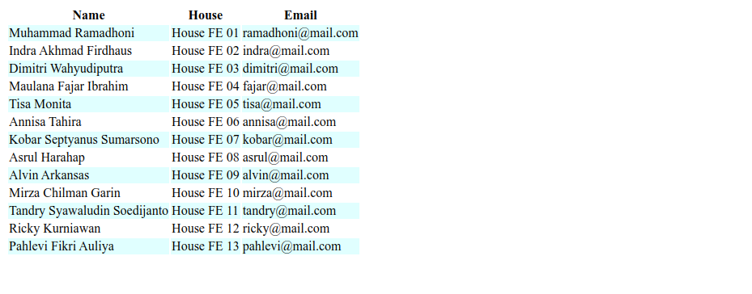
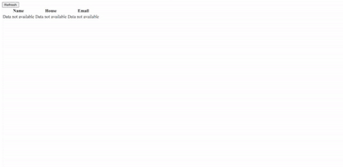

# List & Keys and Conditional Rendering

## Exercise - 5

### NOTES

- Pada skeleton kode yang terdapat file `main.test.js` tidak boleh diubah sama sekali.
- Dilarang mengganti nama function yang diberikan.
- Wajib menjalankan `npm install` atau `pnpm install` sebelum mengerjakan final project.

### Description

**Mentor Data** merupakan sebuah web sederhana untuk menampilkan beberapa data terkait mentor **Frontend**. Kalian diminta untuk mengerjakan pada file `App.js` dan `Table.js` dimana yang harus kalian lakukan yaitu:

- Membuat sebuah button dengan text `Refresh`, dengan kriteria berikut:
  - Saat pertama kali halaman di render maka data mentor tidak akan di tampilkan dan hanya menampilkan pesan "**Data not available**".
    
  - Saat button di klik data mentor akan di tampilkan dan button di _hide_.
    
- Seluruh data mentor didapatkan dari variable `MentorsData` yang sudah diberikan dan kalian **wajib _passing_ data tersebut ke _custom component_ `Table` sebagai `props`**.
- `props` yang di terima pada _custom component_ `Table` lah yang **wajib kalian tampilkan dalam table**.
- Jika `id` dari mentor bernilai **ganjil**, maka background color berwarna `lightCyan`.
- Jika `id` dari mentor bernilai **genap**, maka background color berwarna `white`.
- Seluruh data mentor disimpan dalam tag HTML `td`
  ```html
  <td>mentor name</td>
  <td>mentor house</td>
  <td>mentor email</td>
  ```

Berikut contoh yang perlu kalian buat:

