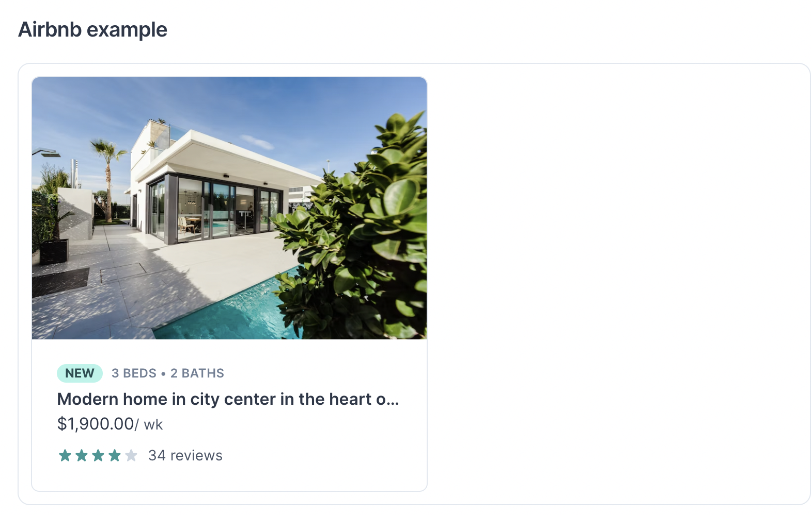

## Chakra Fundamental Exercise

Untuk exercise kali ini, silahkan teman-teman buka file `src\App.js`, jangan lupa untuk menjalankan `pnpm start` untuk menjalankan server Reactnya.

### Task 1: Create a component with Box



- Function: `Task1`
- Task: Salin komponen di bawah. Tambahkan di komponen `Box` terluar tiga buah atribut: `marginX` dengan value `auto`, `bgColor` dengan value `blue.800`, `color` dengan value `white`. Ambil props `property` yang diterima oleh komponen `Task1` dan tampilkan di dalam komponen `Box` yang sudah dibuat.

```js
function AirbnbCard() {
  const property = {
    imageUrl: "https://bit.ly/2Z4KKcF",
    imageAlt: "Rear view of modern home with pool",
    beds: 3,
    baths: 2,
    title: "Modern home in city center in the heart of historic Los Angeles",
    formattedPrice: "$1,900.00",
    reviewCount: 34,
    rating: 4,
  };

  return (
    <Box maxW="sm" borderWidth="1px" borderRadius="lg" overflow="hidden">
      <Image src={property.imageUrl} alt={property.imageAlt} />

      <Box p="6">
        <Box display="flex" alignItems="baseline">
          <Badge borderRadius="full" px="2" colorScheme="teal">
            New
          </Badge>
          <Box
            color="gray.500"
            fontWeight="semibold"
            letterSpacing="wide"
            fontSize="xs"
            textTransform="uppercase"
            ml="2"
          >
            {property.beds} beds &bull; {property.baths} baths
          </Box>
        </Box>

        <Box
          mt="1"
          fontWeight="semibold"
          as="h4"
          lineHeight="tight"
          noOfLines={1}
        >
          {property.title}
        </Box>

        <Box>
          {property.formattedPrice}
          <Box as="span" color="gray.600" fontSize="sm">
            / wk
          </Box>
        </Box>

        <Box display="flex" mt="2" alignItems="center">
          {Array(5)
            .fill("")
            .map((_, i) => (
              <StarIcon
                key={i}
                color={i < property.rating ? "teal.500" : "gray.300"}
              />
            ))}
          <Box as="span" ml="2" color="gray.600" fontSize="sm">
            {property.reviewCount} reviews
          </Box>
        </Box>
      </Box>
    </Box>
  );
}
```

### Task 2: Create a responsive component with SimpleGrid

- Function: `Task2`
- Task: Buatlah sebuah komponen yang memiliki komponen terluarnya berupa `SimpleGrid` dengan konfigurasi responsive: [1, 2, 4] yang ditaruh di dalam atribut `columns`, dan tambahkan atribut `gap` senilai `14`. Jadikan komponen `Task1` sebagai komponen anak dari `SimpleGrid` tersebut, dan gunakan `Task2_Data` sebagai props untuk mengisi data yang akan ditampilkan oleh `Task1` (lakukan iterasi terhadap data di dalam array `Task2_data`).

### Task 3: Create a modal component with Modal

- Function: `Task3`
- Task: Salin komponen di bawah. Ambil props `title` dan jadikan sebagai isi dari component `ModalHeader`, dan ambil props `body` dan jadikan sebagai isi dari component `ModalBody`. Pastikan Modal bisa dibuka dengan tombol `Button` yang telah disediakan, dan bisa ditutup dengan meng-klik sebuah button di dalam modal bertuliskan `Close`.

```js
function BasicUsage() {
  const { isOpen, onOpen, onClose } = useDisclosure();
  return (
    <>
      <Button onClick={onOpen}>Open Modal</Button>

      <Modal isOpen={isOpen} onClose={onClose}>
        <ModalOverlay />
        <ModalContent>
          <ModalHeader>Modal Title</ModalHeader>
          <ModalCloseButton />
          <ModalBody>
            <Lorem count={2} />
          </ModalBody>

          <ModalFooter>
            <Button colorScheme="blue" mr={3} onClick={onClose}>
              Close
            </Button>
            <Button variant="ghost">Secondary Action</Button>
          </ModalFooter>
        </ModalContent>
      </Modal>
    </>
  );
}
```
