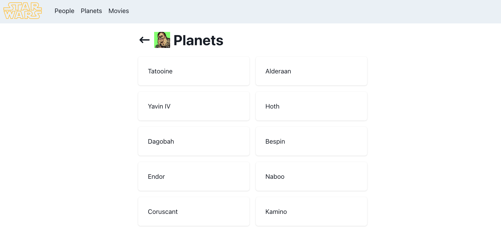

# Nested Routes CP

Website atau aplikasi yang kompleks memiliki sistem routing yang bersarang (nested). Kali ini, walaupun belum terlalu kompleks, kalian diminta untuk membuat sebuah aplikasi yang mengimplementasikan nested routing, mengarahkan perpindahan halaman, serta memanfaatkan URL param

Menggunakan API dari swapi.py4e.com aplikasi ini dapat mengambil & menampilkan info-info yang berkaitan dengan franchise film Star Wars.

## Steps to Run

1. Navigate to `react-exercise-7` directory
2. Run `pnpm install`
3. Run `pnpm start`

## Konsep Web

- Membuat sebuah web yang menampilkan informasi sebagai berikut:
  - Menu **People** yang berisi **karakter-karakter Star Wars**
  - Menu **Planets** yang berisi **planet-planet dalam Star Wars**
  - Menu **Movies** yang berisi **film-film Star Wars**
- Tiap **menu memiliki halaman detail** yang berisi informasi lebih lanjut mengenai _item_ yang diklik

### `App.js`

Pada file `App.js` kalian diminta untuk melengkapi `Route` yang sudah ada, `Route` yang perlu kalian buat yaitu:

- Route dengan _path_ "/star-wars/planets" akan merender _custom component_ `Planets.jsx`.
- Route dengan _path_ "/star-wars/planets/:id" akan merender _custom component_ `PlanetDetail.jsx`.
- Route dengan _path_ "/star-wars/movies" akan merender _custom component_ `Movies.jsx`.
- Route dengan _path_ "/star-wars/movies/:id" akan merender _custom component_ `MovieDetail.jsx`.

---

### `Home.jsx`

Pada halaman Home kalian diminta untuk membuat 3 buah `button`/`Link` dengan kriteria dibawha ini:

- Button dengan teks "People" akan mengarah pada `route` "/star-wars/people" yang akan merender _custom component_ `People.jsx`.
- Button dengan teks "Planets" akan mengarah pada `route` "/star-wars/planets" yang akan merender _custom component_ `Planet.jsx`.
- Button dengan teks "Movies" akan mengarah pada `route` "/star-wars/movies" yang akan merender _custom component_ `Movie.jsx`.

---

### `/star-wars/people`

Perlihatkan daftar `name` dari semua karakter yang didapat dari _3rd Party API_.

Berikut adalah hasil response dari API ini.

```json
{
    "count": 87,
    "next": "https://swapi.py4e.com/api/people/?page=2",
    "previous": null,
    "results": [
        {
            "name": "Luke Skywalker",
            "height": "172",
            "mass": "77",
            "hair_color": "blond",
            "skin_color": "fair",
            "eye_color": "blue",
            "birth_year": "19BBY",
            "gender": "male",
            "homeworld": "https://swapi.py4e.com/api/planets/1/",
            "films": [
                "https://swapi.py4e.com/api/films/1/",
                "https://swapi.py4e.com/api/films/2/",
                "https://swapi.py4e.com/api/films/3/",
                "https://swapi.py4e.com/api/films/6/",
                "https://swapi.py4e.com/api/films/7/"
            ],
            "species": [
                "https://swapi.py4e.com/api/species/1/"
            ],
            "vehicles": [
                "https://swapi.py4e.com/api/vehicles/14/",
                "https://swapi.py4e.com/api/vehicles/30/"
            ],
            "starships": [
                "https://swapi.py4e.com/api/starships/12/",
                "https://swapi.py4e.com/api/starships/22/"
            ],
            "created": "2014-12-09T13:50:51.644000Z",
            "edited": "2014-12-20T21:17:56.891000Z",
            "url": "https://swapi.py4e.com/api/people/1/"
        },
        {
            "name": "C-3PO",
            "height": "167",
            "mass": "75",
            "hair_color": "n/a",
            "skin_color": "gold",
            "eye_color": "yellow",
            "birth_year": "112BBY",
            "gender": "n/a",
            "homeworld": "https://swapi.py4e.com/api/planets/1/",
            "films": [
                "https://swapi.py4e.com/api/films/1/",
                "https://swapi.py4e.com/api/films/2/",
                "https://swapi.py4e.com/api/films/3/",
                "https://swapi.py4e.com/api/films/4/",
                "https://swapi.py4e.com/api/films/5/",
                "https://swapi.py4e.com/api/films/6/"
            ],
            "species": [
                "https://swapi.py4e.com/api/species/2/"
            ],
            "vehicles": [],
            "starships": [],
            "created": "2014-12-10T15:10:51.357000Z",
            "edited": "2014-12-20T21:17:50.309000Z",
            "url": "https://swapi.py4e.com/api/people/2/"
        },
        ...
    ]
}
```

Ketika nama karakter tersebut di klik maka akan mengarah pada _path_ `/star-wars/people/:id`.

---

### `/star-wars/people/:id`

Perlihatkan detil dari karakter yang dipilih dari `id` yang terdapat pada param URL.

Berikut adalah hasil response dari API ini.

```json
{
  "name": "C-3PO",
  "height": "167",
  "mass": "75",
  "hair_color": "n/a",
  "skin_color": "gold",
  "eye_color": "yellow",
  "birth_year": "112BBY",
  "gender": "n/a",
  "homeworld": "https://swapi.py4e.com/api/planets/1/",
  "films": [
    "https://swapi.py4e.com/api/films/1/",
    "https://swapi.py4e.com/api/films/2/",
    "https://swapi.py4e.com/api/films/3/",
    "https://swapi.py4e.com/api/films/4/",
    "https://swapi.py4e.com/api/films/5/",
    "https://swapi.py4e.com/api/films/6/"
  ],
  "species": ["https://swapi.py4e.com/api/species/2/"],
  "vehicles": [],
  "starships": [],
  "created": "2014-12-10T15:10:51.357000Z",
  "edited": "2014-12-20T21:17:50.309000Z",
  "url": "https://swapi.py4e.com/api/people/2/"
}
```

Detil yang perlu diperlihatkan antara lain:

```txt
<name>

Gender
<gender>

Birth Year
<birth_year>

Mass
<mass>

Height
<height>

Eye Color
<eye_color>
```

---

### `/star-wars/planets`

Perlihatkan daftar `name` dari semua planet yang didapat dari _3rd Party API_.

Berikut adalah hasil response dari API ini.

```json
{
    "count": 61,
    "next": "https://swapi.py4e.com/api/planets/?page=2",
    "previous": null,
    "results": [
        {
            "name": "Tatooine",
            "rotation_period": "23",
            "orbital_period": "304",
            "diameter": "10465",
            "climate": "arid",
            "gravity": "1 standard",
            "terrain": "desert",
            "surface_water": "1",
            "population": "200000",
            "residents": [
                "https://swapi.py4e.com/api/people/1/",
                "https://swapi.py4e.com/api/people/2/",
                "https://swapi.py4e.com/api/people/4/",
                "https://swapi.py4e.com/api/people/6/",
                "https://swapi.py4e.com/api/people/7/",
                "https://swapi.py4e.com/api/people/8/",
                "https://swapi.py4e.com/api/people/9/",
                "https://swapi.py4e.com/api/people/11/",
                "https://swapi.py4e.com/api/people/43/",
                "https://swapi.py4e.com/api/people/62/"
            ],
            "films": [
                "https://swapi.py4e.com/api/films/1/",
                "https://swapi.py4e.com/api/films/3/",
                "https://swapi.py4e.com/api/films/4/",
                "https://swapi.py4e.com/api/films/5/",
                "https://swapi.py4e.com/api/films/6/"
            ],
            "created": "2014-12-09T13:50:49.641000Z",
            "edited": "2014-12-20T20:58:18.411000Z",
            "url": "https://swapi.py4e.com/api/planets/1/"
        },
        {
            "name": "Alderaan",
            "rotation_period": "24",
            "orbital_period": "364",
            "diameter": "12500",
            "climate": "temperate",
            "gravity": "1 standard",
            "terrain": "grasslands, mountains",
            "surface_water": "40",
            "population": "2000000000",
            "residents": [
                "https://swapi.py4e.com/api/people/5/",
                "https://swapi.py4e.com/api/people/68/",
                "https://swapi.py4e.com/api/people/81/"
            ],
            "films": [
                "https://swapi.py4e.com/api/films/1/",
                "https://swapi.py4e.com/api/films/6/"
            ],
            "created": "2014-12-10T11:35:48.479000Z",
            "edited": "2014-12-20T20:58:18.420000Z",
            "url": "https://swapi.py4e.com/api/planets/2/"
        },
        ...
    ]
}
```

Ketika nama planet tersebut di klik maka akan mengarah pada _path_ `/star-wars/planets/:id`.

---

### `/star-wars/planets/:id`

Perlihatkan detil dari planet yang dipilih dari `id` yang terdapat pada param URL.

Berikut adalah hasil response dari API ini.

```json
{
  "name": "Yavin IV",
  "rotation_period": "24",
  "orbital_period": "4818",
  "diameter": "10200",
  "climate": "temperate, tropical",
  "gravity": "1 standard",
  "terrain": "jungle, rainforests",
  "surface_water": "8",
  "population": "1000",
  "residents": [],
  "films": ["https://swapi.py4e.com/api/films/1/"],
  "created": "2014-12-10T11:37:19.144000Z",
  "edited": "2014-12-20T20:58:18.421000Z",
  "url": "https://swapi.py4e.com/api/planets/3/"
}
```

Detil yang perlu diperlihatkan antara lain:

```txt
<name>

Rotation Period
<rotation_period>

Orbital Period
<orbital_period>

Terrain
<terrain>

Population
<population>

Diameter
<diameter>

Climate
<climate>
```

---

### `/star-wars/movies`

Perlihatkan daftar `title` dari semua film yang didapat dari _3rd Party API_.

Berikut adalah hasil response dari API ini.

```json
{
    "count": 7,
    "next": null,
    "previous": null,
    "results": [
        {
            "title": "A New Hope",
            "episode_id": 4,
            "opening_crawl": "It is a period of civil war.\r\nRebel spaceships, striking\r\nfrom a hidden base, have won\r\ntheir first victory against\r\nthe evil Galactic Empire.\r\n\r\nDuring the battle, Rebel\r\nspies managed to steal secret\r\nplans to the Empire's\r\nultimate weapon, the DEATH\r\nSTAR, an armored space\r\nstation with enough power\r\nto destroy an entire planet.\r\n\r\nPursued by the Empire's\r\nsinister agents, Princess\r\nLeia races home aboard her\r\nstarship, custodian of the\r\nstolen plans that can save her\r\npeople and restore\r\nfreedom to the galaxy....",
            "director": "George Lucas",
            "producer": "Gary Kurtz, Rick McCallum",
            "release_date": "1977-05-25",
            "characters": [
                "https://swapi.py4e.com/api/people/1/",
                "https://swapi.py4e.com/api/people/2/",
                "https://swapi.py4e.com/api/people/3/",
                "https://swapi.py4e.com/api/people/4/",
                "https://swapi.py4e.com/api/people/5/",
                "https://swapi.py4e.com/api/people/6/",
                "https://swapi.py4e.com/api/people/7/",
                "https://swapi.py4e.com/api/people/8/",
                "https://swapi.py4e.com/api/people/9/",
                "https://swapi.py4e.com/api/people/10/",
                "https://swapi.py4e.com/api/people/12/",
                "https://swapi.py4e.com/api/people/13/",
                "https://swapi.py4e.com/api/people/14/",
                "https://swapi.py4e.com/api/people/15/",
                "https://swapi.py4e.com/api/people/16/",
                "https://swapi.py4e.com/api/people/18/",
                "https://swapi.py4e.com/api/people/19/",
                "https://swapi.py4e.com/api/people/81/"
            ],
            "planets": [
                "https://swapi.py4e.com/api/planets/1/",
                "https://swapi.py4e.com/api/planets/2/",
                "https://swapi.py4e.com/api/planets/3/"
            ],
            "starships": [
                "https://swapi.py4e.com/api/starships/2/",
                "https://swapi.py4e.com/api/starships/3/",
                "https://swapi.py4e.com/api/starships/5/",
                "https://swapi.py4e.com/api/starships/9/",
                "https://swapi.py4e.com/api/starships/10/",
                "https://swapi.py4e.com/api/starships/11/",
                "https://swapi.py4e.com/api/starships/12/",
                "https://swapi.py4e.com/api/starships/13/"
            ],
            "vehicles": [
                "https://swapi.py4e.com/api/vehicles/4/",
                "https://swapi.py4e.com/api/vehicles/6/",
                "https://swapi.py4e.com/api/vehicles/7/",
                "https://swapi.py4e.com/api/vehicles/8/"
            ],
            "species": [
                "https://swapi.py4e.com/api/species/1/",
                "https://swapi.py4e.com/api/species/2/",
                "https://swapi.py4e.com/api/species/3/",
                "https://swapi.py4e.com/api/species/4/",
                "https://swapi.py4e.com/api/species/5/"
            ],
            "created": "2014-12-10T14:23:31.880000Z",
            "edited": "2014-12-20T19:49:45.256000Z",
            "url": "https://swapi.py4e.com/api/films/1/"
        },
        ...
    ]
}
```

Ketika nama film tersebut di klik maka akan mengarah pada _path_ `/star-wars/movies/:id`.

---

### `/star-wars/movies/:id`

Perlihatkan detil dari film yang dipilih dari `id` yang terdapat pada param URL.

Berikut adalah hasil response dari API ini.

```json
{
  "title": "A New Hope",
  "episode_id": 4,
  "opening_crawl": "It is a period of civil war.\r\nRebel spaceships, striking\r\nfrom a hidden base, have won\r\ntheir first victory against\r\nthe evil Galactic Empire.\r\n\r\nDuring the battle, Rebel\r\nspies managed to steal secret\r\nplans to the Empire's\r\nultimate weapon, the DEATH\r\nSTAR, an armored space\r\nstation with enough power\r\nto destroy an entire planet.\r\n\r\nPursued by the Empire's\r\nsinister agents, Princess\r\nLeia races home aboard her\r\nstarship, custodian of the\r\nstolen plans that can save her\r\npeople and restore\r\nfreedom to the galaxy....",
  "director": "George Lucas",
  "producer": "Gary Kurtz, Rick McCallum",
  "release_date": "1977-05-25",
  "characters": [
    "https://swapi.py4e.com/api/people/1/",
    "https://swapi.py4e.com/api/people/2/",
    "https://swapi.py4e.com/api/people/3/",
    "https://swapi.py4e.com/api/people/4/",
    "https://swapi.py4e.com/api/people/5/",
    "https://swapi.py4e.com/api/people/6/",
    "https://swapi.py4e.com/api/people/7/",
    "https://swapi.py4e.com/api/people/8/",
    "https://swapi.py4e.com/api/people/9/",
    "https://swapi.py4e.com/api/people/10/",
    "https://swapi.py4e.com/api/people/12/",
    "https://swapi.py4e.com/api/people/13/",
    "https://swapi.py4e.com/api/people/14/",
    "https://swapi.py4e.com/api/people/15/",
    "https://swapi.py4e.com/api/people/16/",
    "https://swapi.py4e.com/api/people/18/",
    "https://swapi.py4e.com/api/people/19/",
    "https://swapi.py4e.com/api/people/81/"
  ],
  "planets": [
    "https://swapi.py4e.com/api/planets/1/",
    "https://swapi.py4e.com/api/planets/2/",
    "https://swapi.py4e.com/api/planets/3/"
  ],
  "starships": [
    "https://swapi.py4e.com/api/starships/2/",
    "https://swapi.py4e.com/api/starships/3/",
    "https://swapi.py4e.com/api/starships/5/",
    "https://swapi.py4e.com/api/starships/9/",
    "https://swapi.py4e.com/api/starships/10/",
    "https://swapi.py4e.com/api/starships/11/",
    "https://swapi.py4e.com/api/starships/12/",
    "https://swapi.py4e.com/api/starships/13/"
  ],
  "vehicles": [
    "https://swapi.py4e.com/api/vehicles/4/",
    "https://swapi.py4e.com/api/vehicles/6/",
    "https://swapi.py4e.com/api/vehicles/7/",
    "https://swapi.py4e.com/api/vehicles/8/"
  ],
  "species": [
    "https://swapi.py4e.com/api/species/1/",
    "https://swapi.py4e.com/api/species/2/",
    "https://swapi.py4e.com/api/species/3/",
    "https://swapi.py4e.com/api/species/4/",
    "https://swapi.py4e.com/api/species/5/"
  ],
  "created": "2014-12-10T14:23:31.880000Z",
  "edited": "2014-12-20T19:49:45.256000Z",
  "url": "https://swapi.py4e.com/api/films/1/"
}
```

Detil yang perlu diperlihatkan antara lain:

```txt
<title>

Release Date
<release_date>

Produced By
<producer>

Directed By
<director>

Summary
<opening_crawl>
```

## Hasil yang diharapkan

- /star-wars
  
- /star-wars/planets
  
- /star-wars/planets/:id
  
- /star-wars/planets
  
- /star-wars/planets
  
