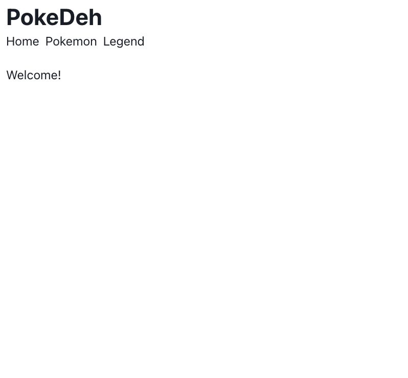
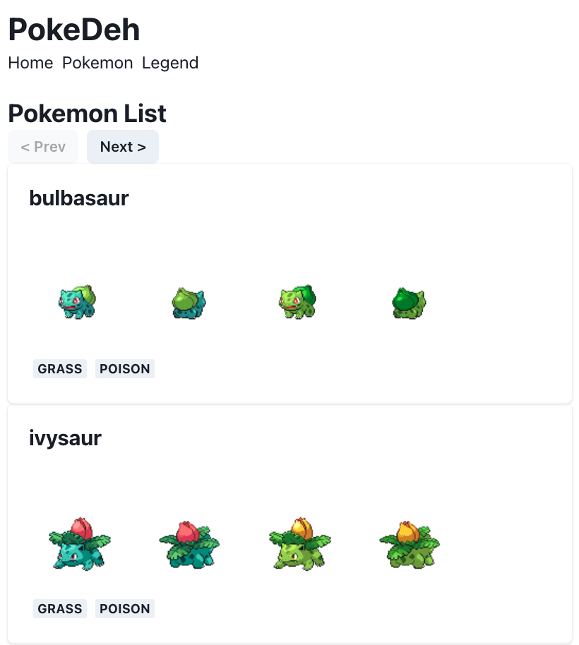
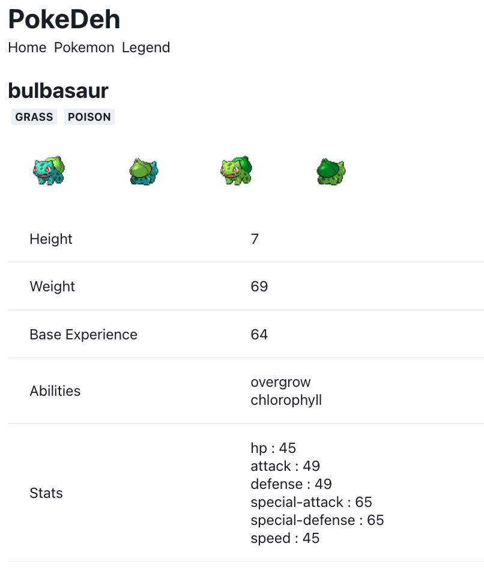
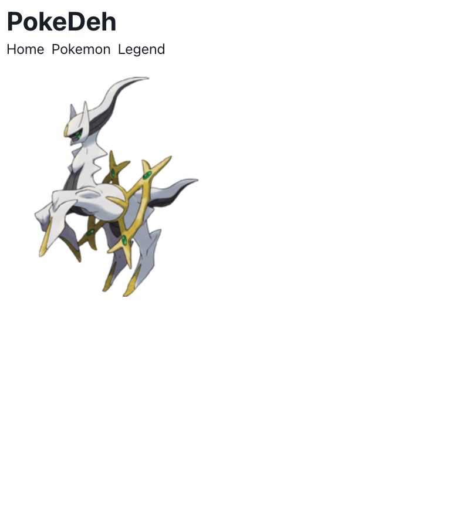
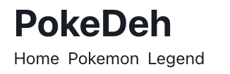
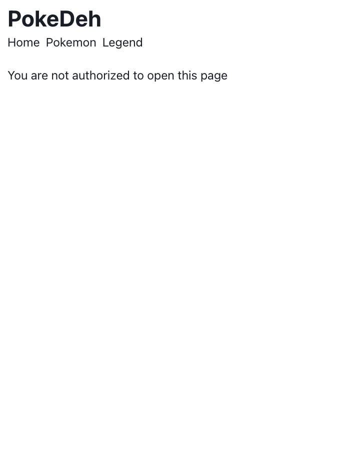

# React Assignment 2: PokeDeh

Untuk exercise kali ini, silakan teman-teman buka file `src\App.js`, jangan lupa untuk menjalankan `pnpm start` untuk menjalankan server Reactnya.

Untuk menjalankan test-casenya, selain bisa menggunakan `grader-cli test`, teman-teman juga bisa menggunakan `pnpm test`.

## Styling

Gunakan Chakra-UI, disarankan bermain-main dengan komponen-komponen menarik Chakra UI di [sini](https://chakra-ui.com/docs/components). Diperbolehkan juga mengganti warna. Mari jadikan web kamu menarik :D

## Routing

Kita memiliki 3 halaman:

### Homepage: `/`

Component: `src/Home.js`

Homepage hanya berisi tulisan `Welcome!`

### Pokemon List Page: `/pokemon`

Component: `src/PokemonList.js`

Halaman ini berisi list pokemon yang diambil dari API [pokeapi](https://pokeapi.co/). Di halaman ini ditampilkan 20 pokemon per halaman.

Di bagian atas, ada button navigasi:

- Prev: untuk berpindah ke halaman sebelumnya
- Next: untuk berpindah ke halaman selanjutnya

Jika halaman sebelumnya tidak ada (halaman ke 0), maka button Prev akan disabled.

Perpindahan halaman dilakukan dengan mengubah query parameter `page` di URL:

`/pokemon?page=2`

Khusus untuk halaman satu, query parameter `page` tidak perlu ditampilkan:

`/pokemon` sama dengan `/pokemon?page=1`

Masing-masing pokemon ditampilkan dalam bentuk Card, jika di klik, maka akan menuju ke halaman detail pokemon terkait.

Untuk masing-masing Cardnya, tampilkan:

- Nama pokemon
- Gambar pokemon (`front_default`, `back_default`, `front_shiny`, `back_shiny`). Untuk masing-masing gambar, tambahkan `alt` attribute sebagai berikut: `Front Default`, `Back Default`, `Front Shiny`, `Back Shiny`
- Pokemon Types

### Pokemon Detail Page: `/pokemon/:pokemonId`

Component: `src/PokemonDetail.js`

Halaman ini berisi detail dari pokemon yang dipilih.

Detail yang perlu ditampilkan field:

- `name`
- `type.name`
- `height`
- `weight`
- `abilities`
- `stats`

### Legend Page: `/legend`

Component: `src/Legend.js` dan `src/ProtectedRoute.js`

Ini adalah halaman rahasia! :D

Untuk masuk ke halaman ini, kita perlu menambahakan query parameter password dengan value `secret` di URL:

`/legend?password=secret`

Jika password salah, atau tidak ada query parameter password, maka akan diredirect ke `/unauthorized`.

Pssst, a little secret between us: halaman ini bisa dibuka juga dengan **double** click menu "Legend":

### Unauthorized Page: `/unauthorized`

Component: `src/Unauthorized.js`

Halaman ini hanya menampilkan text `You are not authorized to open this page`

