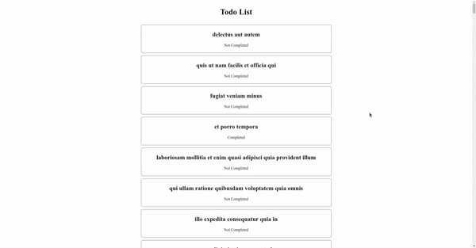

# Todo List

## Assignment

### NOTES

- Pada skeleton kode yang terdapat file `main.test.js` tidak boleh diubah sama sekali.
- Dilarang mengganti nama function yang diberikan.
- Wajib menjalankan `npm install` atau `pnpm install` sebelum mengerjakan assignment.

### Description

_**Todo List**_ merupkan sebuah web sederhana dimana kalian diminta untuk melakukan _fetch_ data dari sebuah _3rd party API_ yang sudah disediakan, yang mana hasil akhirnya seperti contoh dibawah ini:



Kalian diminta untuk mengerjakan pada file `App.js` dan `TodoCard.js`.

---

### `App.js`

Pada file ini kalian diminta untuk melakukan _fetch_ data dari _3rd party API_ berikut:

```txt
https://jsonplaceholder.typicode.com/todos
```

Contoh result dari _3rd party API_ diatas berupa JSON dengan format:

| Name        | Data Type |
| ----------- | --------- |
| _userId_    | integer   |
| _id_        | integer   |
| _title_     | string    |
| _completed_ | boolean   |

```json
// Result
[
  {
    "userId": 1,
    "id": 1,
    "title": "delectus aut autem",
    "completed": false
  },
  {
    "userId": 1,
    "id": 2,
    "title": "quis ut nam facilis et officia qui",
    "completed": false
  },
  {
    "userId": 1,
    "id": 3,
    "title": "fugiat veniam minus",
    "completed": false
  }
]
```

Jika data belum ada maka akan menampilkan pesan "**Loading...**" dalam elemen `h1`, namun jika data yang di terima sudah ada maka akan dilempar ke dalam _custom component_ `TodoCard` yang sebelumnya perlu kalian _import_.

---

### `TodoCard.js`

File ini akan membuat sebuah _custom component_ `TodoCard` yang akan menerima data yang sudah dilempar dari _parent_-nya (`App.js`) dan ditampilkan dalam bentuk _card_ dengan ketentuan sebagai berikut:

- Elemen untuk membuat _card_ memiliki class dengan nilai `todo-card`
- `Title` pada _todo list_ dibungkus oleh elemen `h2`
- `Status` pada _todo list_ dibungkus oleh elemen `p`
  - Jika status yang diterima bernilai `false` maka akan menampilkan "Not Completed"
  - Jika status yang diterima bernilai `true` maka akan menampilkan "Completed"
- Jika _card_ diklik, maka akan memunculkan _alert_ dengan pesan "todo dengan id `<todo id>` telah di clicked"
