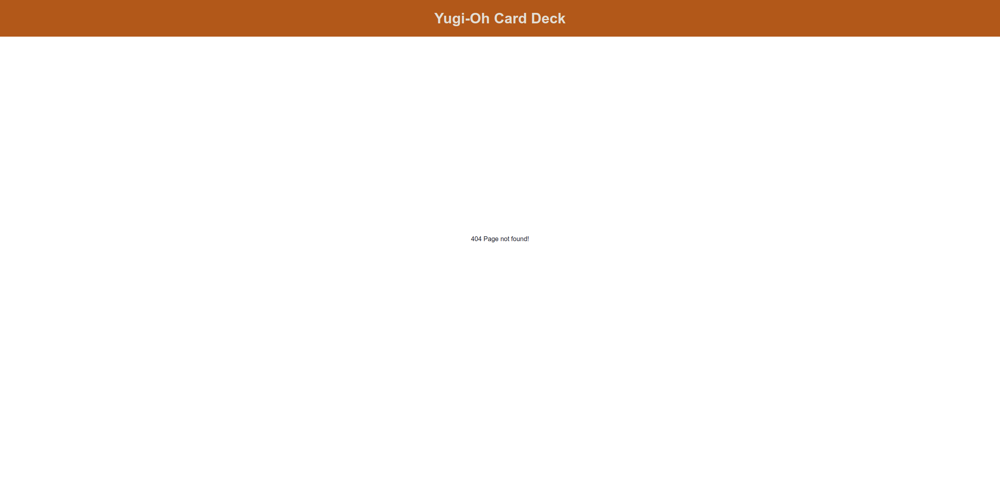
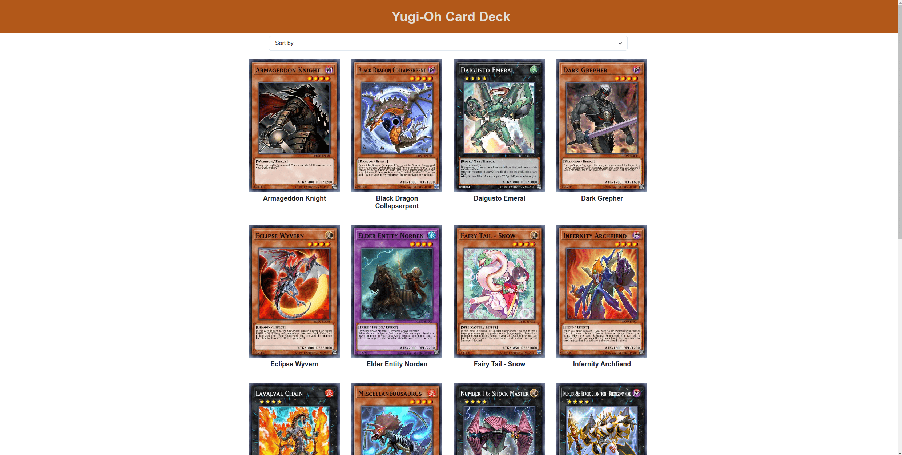
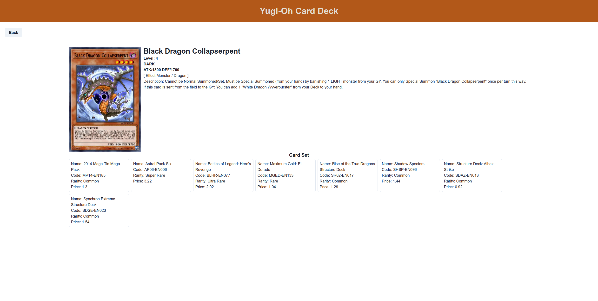

# Yu-Gi OH!

## Final Course Project

### NOTES

- Pada skeleton kode yang terdapat file `main.test.js` tidak boleh diubah sama sekali.
- Dilarang mengganti nama function yang diberikan.
- Wajib menjalankan `npm install` atau `pnpm install` sebelum mengerjakan final project.
- Wajib menggunakan beberapa komponen dari Chakra UI.

### Description

**Yu-Gi OH!** merupakan sebuah web sederhana untuk menampilkan beberapa kartu. Kalian diminta untuk melakukan _fetch_ data dari sebuah _3rd party API_ yang sudah disediakan, yang mana hasil akhirnya bisa kalian lihat di sini.

[](https://drive.google.com/file/d/1UYPGN987pfn9xG9vm1bEPoTz2ML6LLgl/view?usp=sharing)
Klik gambar untuk melihat video preview

Kalian diminta untuk mengerjakan pada file`index.js`, `App.js`, `Home.js`, `Cards.js`, dan `Detail.js`.

---

### `index.js`

Pada file ini kalian diminta untuk **melakukan konfigurasi React router DOM dan Chakra UI**. Kalian diperbolehkan menggunakan `CSSReset` yang dimiliki oleh Chakra UI. Gunakanlah function `AnswerHere` untuk mengerjakan jawaban kalian.

---

### `App.js`

Pada file ini, kalian diminta untuk membuat `Routes` untuk aplikasi ini, berikut ketentuannya:

- Buatlah `Route` dengan path "`/`" yang akan merender komponen `Home`.
- Buatlah `Route` dengan path "`/card/:id`" yang akan merender komponen `Details`.
- Buatlah `Route` yang akan merender komponen "**404 Page not found!**", yang akan di tampilkan jika user memasukan url tertentu yang tidak kita handle. Berikut contohnya:
  

Kalian dapat melakukan pembuatan `Routes` pada function `MyRouter` yang sudah disediakan.

---

### _Custom component_ `Home` (`Home.js`)

Pada file ini kalian diminta untuk melakukan _fetch_ data dari _3rd party API_ berikut:

```txt
https://db.ygoprodeck.com/api/v7/cardinfo.php?banlist=tcg&level=4
```

Contoh result dari _3rd party API_ di atas berupa JSON dengan format:

```json
// Result
{
  "data": [
    {
      "id": 28985331,
      "name": "Armageddon Knight",
      "type": "Effect Monster",
      "desc": "When this card is Summoned: You can send 1 DARK monster from your Deck to the GY.",
      "atk": 1400,
      "def": 1200,
      "level": 4,
      "race": "Warrior",
      "attribute": "DARK",
      "card_sets": [
        {
          "set_name": "Turbo Pack: Booster One",
          "set_code": "TU01-EN011",
          "set_rarity": "Rare",
          "set_rarity_code": "(R)",
          "set_price": "2"
        }
      ],
      "banlist_info": {
        "ban_tcg": "Limited",
        "ban_ocg": "Limited"
      },
      "card_images": [
        {
          "id": 28985331,
          "image_url": "https://images.ygoprodeck.com/images/cards/28985331.jpg",
          "image_url_small": "https://images.ygoprodeck.com/images/cards_small/28985331.jpg"
        }
      ],
      "card_prices": [
        {
          "cardmarket_price": "0.06",
          "tcgplayer_price": "0.12",
          "ebay_price": "1.48",
          "amazon_price": "1.00",
          "coolstuffinc_price": "2.99"
        }
      ]
    },
    ...
  ]
}
```

Jika data belum ada maka akan menampilkan pesan "**Loading...**" dalam elemen `h1`, namun jika data yang diterima sudah ada maka akan dilempar ke dalam _custom component_ `Cards` yang sebelumnya perlu kalian _import_. Kalian diwajibkan menggunakan komponen `SimpleGrid` dari **Chakra UI** untuk membungkus _custom component_ `Cards`.

Selain itu kalian juga diminta untuk menggunakan komponen `Select` dari **Chakra UI** yang memiliki _attribute_ `name` dengan value "`sort`".

Di komponen `Select` tersebut perlu melakukan _sort_ data berdasarkan _name_, _attack_, dan _defence_ dari setiap kartu. **Sort dilakukan dari nilai yang terendah ke yang tertinggi**. Gunakan lah _function_ `sortData` yang sudah diberikan untuk mengerjakan logic-nya.

Berikut contohnya:



---

### _Custom component_ `Cards` (`Cards.js`)

File ini akan membuat sebuah _custom component_ `Cards` yang akan menerima data yang sudah dilempar dari _parent_-nya (`Home.js`) dan ditampilkan dalam bentuk _card_ dengan ketentuan sebagai berikut:

- Elemen untuk membuat _card_ menggunakan komponen `Box` **Chakra UI** yang memiliki `class` dengan value "`yugioh-card`".
- Image menggunakan komponen `Image` **Chakra UI**.
- `Card name` menggunakan komponen `Heading` **Chakra UI** sebagai `h2`.
- Jika componen ini di klik maka akan berpindah ke halaman detail dan _custom component_ `Detail` akan di render berdasarkan `id` dari setiap data _card_. Gunakanlah `Link` dari **React router DOM** sebagai _wrapper_ untuk mengerjakan hal tersebut.

Berikut contohnya:


### _Custom component_ `Detail` (`Detail.js`)

File ini akan membuat sebuah _custom component_ `Detail`, dimana kalian perlu melakuan fetch data dari _3rd party API_ dibawah ini:

```txt
https://db.ygoprodeck.com/api/v7/cardinfo.php?id=<card id>
```

Contoh result dari _3rd party API_ di atas berupa JSON dengan format:

```json
// Result
{
  "data": [
    {
      "id": 28985331,
      "name": "Armageddon Knight",
      "type": "Effect Monster",
      "desc": "When this card is Summoned: You can send 1 DARK monster from your Deck to the GY.",
      "atk": 1400,
      "def": 1200,
      "level": 4,
      "race": "Warrior",
      "attribute": "DARK",
      "card_sets": [
        {
          "set_name": "Turbo Pack: Booster One",
          "set_code": "TU01-EN011",
          "set_rarity": "Rare",
          "set_rarity_code": "(R)",
          "set_price": "2"
        }
      ],
      "banlist_info": {
        "ban_tcg": "Limited",
        "ban_ocg": "Limited"
      },
      "card_images": [
        {
          "id": 28985331,
          "image_url": "https://images.ygoprodeck.com/images/cards/28985331.jpg",
          "image_url_small": "https://images.ygoprodeck.com/images/cards_small/28985331.jpg"
        }
      ],
      "card_prices": [
        {
          "cardmarket_price": "0.06",
          "tcgplayer_price": "0.12",
          "ebay_price": "1.48",
          "amazon_price": "1.00",
          "coolstuffinc_price": "2.99"
        }
      ]
    }
  ]
}
```

Pada halaman detail kalian diminta untuk menampilkan beberapa data yang didapatkan dengan ketentuan berikut:

- Elemen untuk membuat _card_ menggunakan komponen `Box` **Chakra UI**.
- Terdapat `button` _back_ yang akan mengembalikan halaman ke page `Home`. `button` dibuat menggunakan komponen `Button` **Chakra UI**.
- Image menggunakan komponen `Image` **Chakra UI**.
- `Card name` menggunakan komponen `Heading` **Chakra UI** sebagai `h2`.
- Card `level`, `attribute`, `attack`, `defence`, `type`, `race`, dan `desc` menggunakan komponen `Text` **Chakra UI**.

Berikut format penulisannya:

```txt
<name>
Level: <level>
<attribute>
ATK/<attack> DEF/<defence>
[ <type> / <race> ]
<description>
```

Selain itu kalian juga perlu membuat `card` untuk data `card_sets` yang di dapat dengan ketentuan berikut:

- Elemen untuk membuat _card_ menggunakan komponen `Box` **Chakra UI**.
- `set_name`, `set_code`, `set_rarity`, `set_price` dibuat menggunakan komponen `Text` **Chakra UI**.

Berikut format penulisannya:

```txt
Name: <set_name>
Code: <set_code>
Rarity: <set_rarity>
Price: <set_price>
```

Jika data belum ada maka akan menampilkan pesan "**Loading...**" dalam elemen `h1`, namun jika data yang diterima sudah ada maka akan ditampilkan.

Berikut contohnya:


